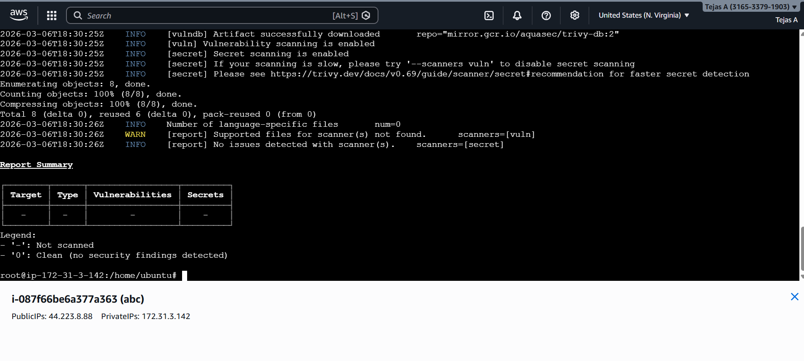

# Automated AWS EKS Cluster Deployment using Terraform and Jenkins

## Project Overview

This project demonstrates how to automate the creation of an **Amazon EKS (Elastic Kubernetes Service)** cluster using **Terraform** and integrate it with a **Jenkins CI/CD pipeline**.
The goal of this project is to provision AWS infrastructure automatically and deploy containerized applications to Kubernetes with minimal manual intervention.

---

## Architecture

* **Terraform** provisions AWS infrastructure such as VPC, subnets, and the EKS cluster.
* **Jenkins Pipeline** automates infrastructure provisioning using Terraform.
* **Amazon EKS** runs the Kubernetes control plane and worker nodes.
* **kubectl** is used to deploy and manage applications in the Kubernetes cluster.

---

## Tools & Technologies

* AWS (EKS, VPC, EC2, IAM)
* Terraform – Infrastructure as Code (IaC)
* Jenkins – CI/CD automation
* Kubernetes
* Docker
* Git
* Linux
* Trivy (Security Scanner)

---

## Key Features

* Automated **AWS infrastructure provisioning** using Terraform
* **Jenkins CI/CD pipeline** for infrastructure automation
* Secure **VPC configuration** with public and private subnets
* Kubernetes cluster management using **kubectl**
* Container orchestration using **Amazon EKS**
* Security scanning using **Trivy**

---

## Project Structure

```
.
├── terraform
│   ├── main.tf
│   ├── variables.tf
│   ├── outputs.tf
│
├── pipeline
│   └── Jenkinsfile(pipeline)
│
├── trivy.png
└── README.md
```

---

## Setup Steps

### 1. Initialize Terraform

Initialize Terraform and download the required providers.

```
terraform init
```

---

### 2. Plan Infrastructure

This command shows what infrastructure Terraform will create without actually creating it.

```
terraform plan
```

---

### 3. Apply Infrastructure

This step provisions the AWS infrastructure and creates the EKS cluster.

```
terraform apply
```

---

### 4. Configure kubectl for EKS

Connect kubectl to the EKS cluster.

```
aws eks update-kubeconfig --region <region> --name <cluster-name>
```

---

### 5. Deploy Application to Kubernetes

Deploy an application to the Kubernetes cluster.

```
kubectl apply -f deployment.yaml
```

---

# Security Scanning with Trivy

This project includes **security scanning using Trivy** to detect vulnerabilities and exposed secrets in the repository.

### Trivy Command Used

```
trivy repo <repository-url>
```

Example:

```
trivy repo https://github.com/Tejas886/Tejas886
```

---

### Trivy Scan Result

The following screenshot shows the vulnerability scan result generated by Trivy.



The scan confirmed that **no vulnerabilities or exposed secrets were detected** in the repository during the scan.

---

## Learning Outcomes

* Hands-on experience with **Amazon EKS cluster setup**
* Practical knowledge of **Infrastructure as Code using Terraform**
* Experience building **CI/CD pipelines using Jenkins**
* Kubernetes application deployment and cluster management
* Security scanning using **Trivy**

---
## Author
Tejas A
DevOps Engineer | AWS | Kubernetes | Terraform | Jenkins | Docker | Linux
